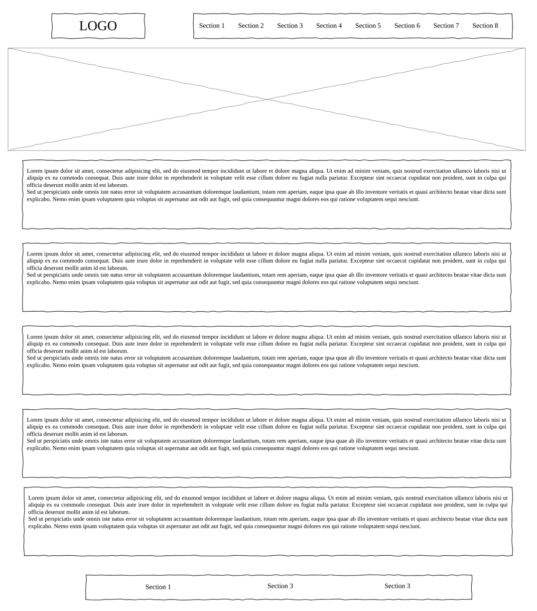

# HYF-Rebuild

> We're building a website with free training programs for diverse individuals.

## Table of contents

- [Name of project](#hyf-rebuild)
  - [Table of contents](#table-of-contents)
  - [General info](#general-info)
  - [Wireframe](#wireframe)
  - [Website-prototype](#website-prototype)
  - [Technologies](#technologies)
  - [Setup](#setup)
  - [Status](#status)
  - [Inspiration](#inspiration)
  - [Team members](#team-members)

## General info

> Building a website for free training programs for diverse backgrounds to
> foster innovation and growth.

## Wireframe

## Website prototype

## Technologies

- Node 14.16.0
- VSC code
- HTML
- CSS
- GitHub

## Setup

- Assign a group leader to create a repo on _GitHub_ named hyf-rebuild
- Add collaborators and give them write access
- Protect the _main_ branch; turn on _discussions_; copy the _link_ from _GitHub
  pages_ and paste it in the repo description for _live demo_;
- Clone the _repo_ locally and open it with _VS Code_ Create a new _branch_ and
  run _npm checks_

## Status

Project is: done

## Inspiration

Hack Your Future initial website: <https://www.hackyourfuturebelgium.be/>

## Team Members

- [Misha](https://github.com/MishaShevchenko)
- [Younes](https://github.com/younes8888)
- [Lishan](https://github.com/Lishan6)
- [Etefa](https://github.com/edinssa)
