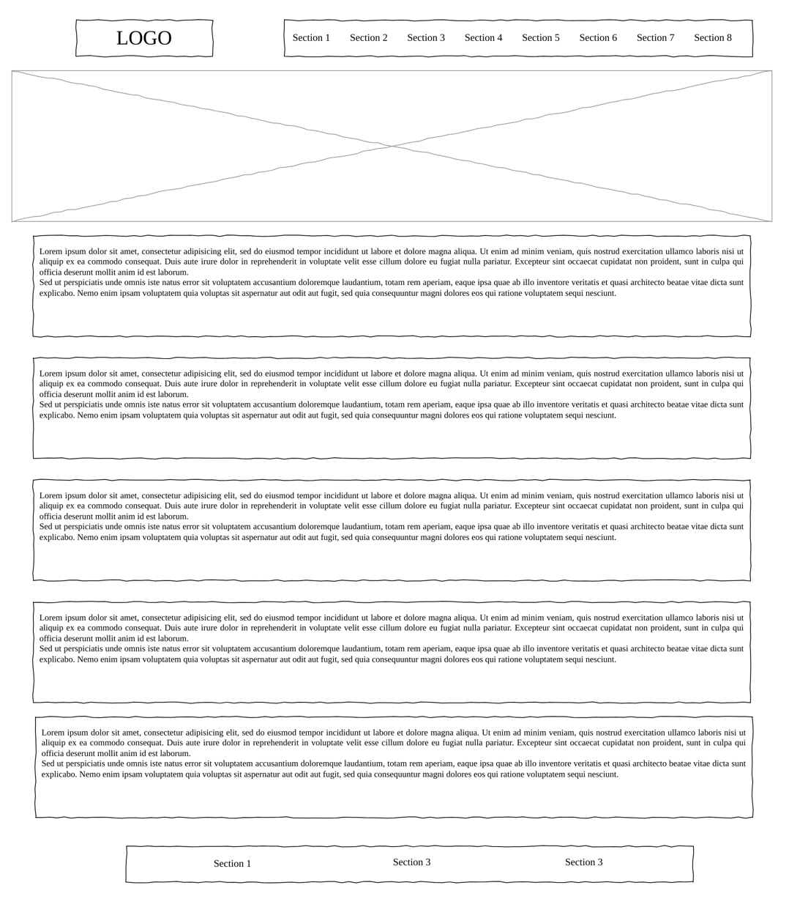

# Design

## Project's design overview

The objective of this project is to create a website that offers free training programs to people from diverse cultural backgrounds. The training programs come in two categories: 5-months and 8-months. The 8-month program is designed for individuals who want to become full-stack developers. The 5-month program is intended for individuals who want to specialize either in front-end or back-end development.

The website will have a navigation section with tabs that include the following: program details, volunteer, about, recruit, blog, support us, why become a partner?, and FAQ. The main section will be divided into three parts: who are we?, the program, and the goal.

Additionally, there will be a section that showcases the partners and sponsors of the project. Another section will feature testimonials from alumni who have shared their experiences. The website will also include a section that suggests subscribing to newsletters. Finally, the footer will contain contact us, support, partnership, and volunteer tabs.

## Wireframe(s)

